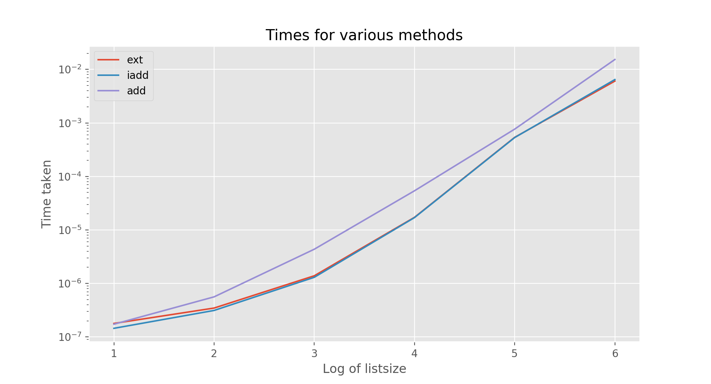

## Through the CPython Looking Glass
<br><br>
#### `extend` and `+=` on lists
#### Varun Nayyar

---

### Setting the stage

```python
def main(config):
    cmd = ["/company/binary"]
    ...
    if config.dryrun:
        cmd += ["--dest", "localhost", "--dryrun"]
```

- “Use extend instead, += is slower and less efficient. This will create new list from originals and concatenate“
- “But += is more pythonic. Doesn’t matter for small lists”
- Good excuse to avoid work!!

---

### Simple Solution - `extend`

```python
# extend
>>> a = [1]
>>> b = a
>>> a.extend([2])
>>> a
[1, 2]
>>> b
[1, 2]
```

---
### Simple Solution - `+=`
```python
# +=
>>> a = [1]
>>> b = a
>>> a += [2]
>>> a
[1, 2]
>>> b
[1, 2]
```

---
#### Simple Solution - `timeit`



`N` repeats, 1 run

---

@snap[center]
<h1> Solved? </h1>
@snapend

---

@snap[center]
<h2> Too Easy!! </h2>
<h2> We need to go deeper! </h2>
@snapend

---

### Binary Ops in Python

- Let’s use [PEP 465 - Matmul(@)](https://github.com/python/cpython/commit/d51374ed78a3e3145911a16cdf3b9b84b3ba7d15) as a guide!
- `ceval.c` executes the ast
- `object.h` defines the structs of functions
- `abstract.c` defines how operations are carried out
- `listobject.c` defines how lists behave


--- 

### ceval.c:1280-1304

```c
TARGET(BINARY_ADD) {
    PyObject *right = POP();
    PyObject *left = TOP();
    PyObject *sum;
    /* NOTE(haypo): Please don't try to micro-optimize int+int on
       CPython using bytecode, it is simply worthless.
       See http://bugs.python.org/issue21955 and
       http://bugs.python.org/issue10044 for the discussion. In short,
       no patch shown any impact on a realistic benchmark, only a minor
       speedup on microbenchmarks. */
    if (PyUnicode_CheckExact(left) &&
             PyUnicode_CheckExact(right)) {
        sum = unicode_concatenate(left, right, f, next_instr);
        /* unicode_concatenate consumed the ref to left */
    }
    else {
        sum = PyNumber_Add(left, right);
        Py_DECREF(left);
    }
    Py_DECREF(right);
    SET_TOP(sum);
    if (sum == NULL)
        goto error;
    DISPATCH();
}
```

@[5-10](Some Nice Comments)
@[18,20](We'll discuss later)
@[17](We call PyNumber_Add)

---

### PyNumber_Add 
abstract.c:951-964

```c
PyObject *
PyNumber_Add(PyObject *v, PyObject *w)
{
    PyObject *result = binary_op1(v, w, NB_SLOT(nb_add));
    if (result == Py_NotImplemented) {
        PySequenceMethods *m = v->ob_type->tp_as_sequence;
        Py_DECREF(result);
        if (m && m->sq_concat) {
            return (*m->sq_concat)(v, w);
        }
        result = binop_type_error(v, w, "+");
    }
    return result;
}
```

---

### object.h

- Defines `PyTypeObject` which is the base for every object in CPython (simplified)

```c
typedef struct _typeobject {
    PyObject_VAR_HEAD
    const char *tp_name; /* For printing, in format "<module>.<name>" */
    Py_ssize_t tp_basicsize, tp_itemsize; /* For allocation */
...
    /* Method suites for standard classes */

    PyNumberMethods *tp_as_number;
    PySequenceMethods *tp_as_sequence;
    PyMappingMethods *tp_as_mapping;

...
} PyTypeObject;

```


---
### listobject.c

```c
static PySequenceMethods list_as_sequence = {
    (lenfunc)list_length,                       /* sq_length */
    (binaryfunc)list_concat,                    /* sq_concat */
    (ssizeargfunc)list_repeat,                  /* sq_repeat */
    (ssizeargfunc)list_item,                    /* sq_item */
    0,                                          /* sq_slice */
    (ssizeobjargproc)list_ass_item,             /* sq_ass_item */
    0,                                          /* sq_ass_slice */
    (objobjproc)list_contains,                  /* sq_contains */
    (binaryfunc)list_inplace_concat,            /* sq_inplace_concat */
    (ssizeargfunc)list_inplace_repeat,          /* sq_inplace_repeat */
};
```


@[3,10](Functions of Interest)

---

### += vs extend

- `+=` uses `sq_inplace_concat` which is `list_inplace_concat`
- `extend` uses `list_extend` as per `listobject.c.h` 

```cpp
#define LIST_EXTEND_METHODDEF    \
    {"extend", (PyCFunction)list_extend, METH_O, list_extend__doc__},
```

---

### += vs extend

```c
static PyObject *
list_inplace_concat(PyListObject *self, PyObject *other)
{
    PyObject *result;

    result = list_extend(self, other);
    if (result == NULL)
        return result;
    Py_DECREF(result);
    Py_INCREF(self);
    return (PyObject *)self;
}
```

`+=` is `extend` with an extra function call!!

---

### Aside: Reference Counting 

- Python uses reference counting for memory management. This is quick and efficient, but not very thread safe and is a big reason for the GIL hanging around.
- garbage collection too for reference cyles. Think `l=[]; l.append(l)`.

---

### Aside: Reference Counting 

```python
def func(b):
    a = [1, 2, 3]
    b.append(a)
``` 
- in the above, we create a variable `a` that is only used in the scope of func. However, since `b` has a reference to it, we cannot free it.  
- `INCREF` is easy, just increments reference count. `DECREF` decrements, checks if 0 and if so, calls the `deallocate` method

---

### Aside: `Py_INCREF` in `append`

```c
static int
app1(PyListObject *self, PyObject *v)
{
    Py_ssize_t n = PyList_GET_SIZE(self);

    assert (v != NULL);
    if (n == PY_SSIZE_T_MAX) {
        PyErr_SetString(PyExc_OverflowError,
            "cannot add more objects to list");
        return -1;
    }

    if (list_resize(self, n+1) < 0)
        return -1;

    Py_INCREF(v);
    PyList_SET_ITEM(self, n, v);
    return 0;
}
```

---
### Aside: `Py_DECREF` in `clear`

- `DECREF` doesn't work for `pop` since reference is passed out (`a=lst.pop`), the reference is inherited by variable.
- Furthermore if this didn't happen `DECREF` would hit 0 if it didn't belong to the list or the new var, and would be cleared instantly.

---
### Aside: `Py_DECREF` in `clear`

```c
static int
_list_clear(PyListObject *a)
{
    Py_ssize_t i;
    PyObject **item = a->ob_item;
    if (item != NULL) {
        /* Because XDECREF can recursively invoke operations on
           this list, we make it empty first. */
        i = Py_SIZE(a);
        Py_SIZE(a) = 0;
        a->ob_item = NULL;
        a->allocated = 0;
        while (--i >= 0) {
            Py_XDECREF(item[i]);
        }
        PyMem_FREE(item);
    }
    /* Never fails; the return value can be ignored.
       Note that there is no guarantee that the list is actually empty
       at this point, because XDECREF may have populated it again! */
    return 0;
}
```
- `XDECREF` doesn't fail on NULL
- `XDECREF may have populated it again` if `__del__` does naughty things!


---

### Aside: List growth
listobject.c:50-59
```c
    /* This over-allocates proportional to the list size, making room
     * for additional growth.  The over-allocation is mild, but is
     * enough to give linear-time amortized behavior over a long
     * sequence of appends() in the presence of a poorly-performing
     * system realloc().
     * The growth pattern is:  0, 4, 8, 16, 25, 35, 46, 58, 72, 88, ...
     * Note: new_allocated won't overflow because the largest possible value
     *       is PY_SSIZE_T_MAX * (9 / 8) + 6 which always fits in a size_t.
     */
    new_allocated = (size_t)newsize + (newsize >> 3) + (newsize < 9 ? 3 : 6);

```
- not quite a linked list, not quite a vector!!

---
### Are we done??

- Hell nah, let's use this knowledge to build a version of python with additional syntax
- we can't change existing syntax too easily since we'll interfere with existing operations, but we can add new syntax
- Let's make `>>` and `<<` append and prepend operators respectively (not in place)
- Maybe introduce a memory leak?

---

### Live Coding Demo

- building on 3.7 on commit: `8f7bb100d0fa7fb2714f3953b5b627878277c7c6`
- branch `listnum` has solution in case of failure. Use `git diff master` to show differences
- branch off top commit to allow comparison to fixed code
- configured build output is `~/Documents/testpython`
- hacked avail on github `nayyarv/cpython`